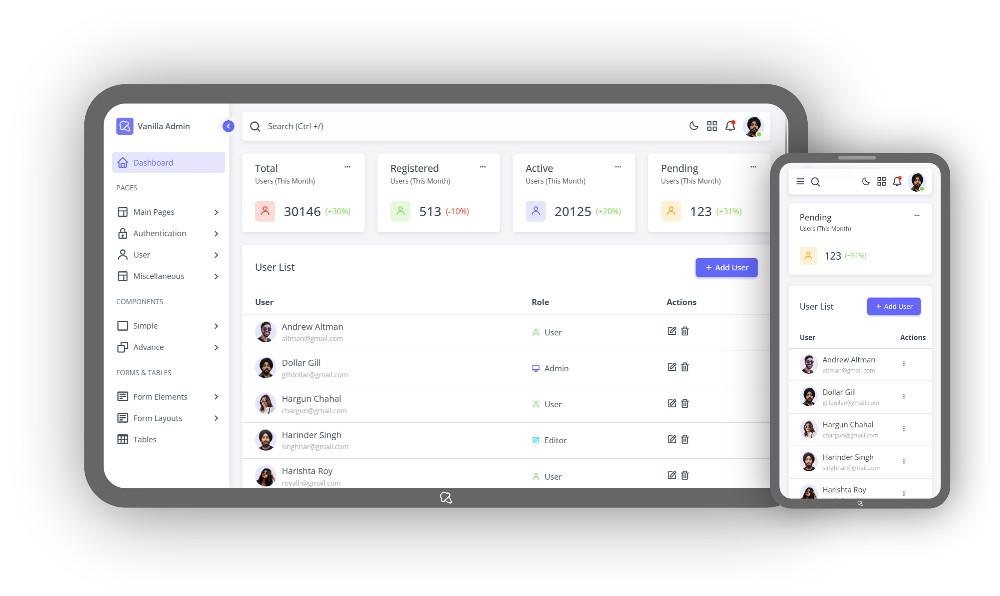

# Vanilla Admin

Admin Dashboard using HTML, JS and CSS

Live Preview: [Vanilla Admin](https://softsingh.github.io/vanilla-admin/)

## To Do
- Color Palettes using CSS Color Mix
- Dark Mode
- Breadcrumbs
- Carousels
- Toast Stacking
- Icons
- Progress Bars
- Form Elements - Advance
- Form Layouts
- Tables
- Graphs & Charts

## Known Issues
- Toast and Tooltip wraping in small screen
